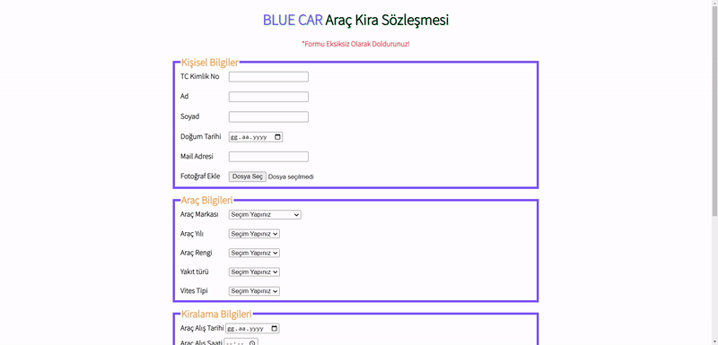

# Blue Car Rental Form

## Table of contents

- [Overview](#overview)
  - [The challenge](#the-challenge)
  - [Screenshot](#screenshot)
  - [Links](#links)
- [My process](#my-process)
  - [Built with](#built-with)

## Overview

### The challenge

Your company has recently started on a project that aims to conduct a survey to measure the demands and interests of its customers. So you and your colleagues have started to work on the project.

### Screenshot

### Links

- Live: [Live Website](https://sezginakgul.github.io/blue-car-rental-form/)

### Built with

- Semantic HTML5 markup
- CSS custom properties
- Flexbox
- CSS Grid
- Mobile-first workflow
- Styled Components - For styles
- HTML Forms-Input Types
- HTML Form Elements
- CSS Colors-Border Properties
- CSS Margins-Padding
- CSS Properties for Texts-Font Families-Links

